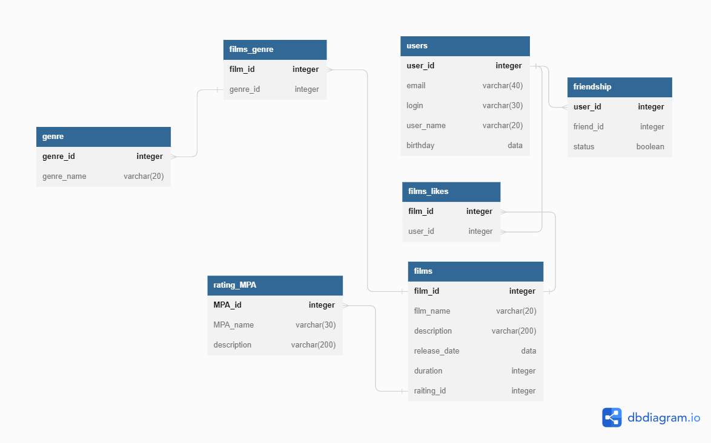

# Filmorate
## Функционал и возможности приложения:
* добавлять фильм в хранилище;
* находить нужный фильм в хранилище;
* удалять фильмы из хранилища;
* комментировать и лайкать фильмы;
* узнавать MPA рейтинг фильма;
* узнавать жанр фильма;
* получать самые популярные фильмы;
* добавлять пользователей в список друзей;
* удалять пользователей из списка друзей;

## База данных

- [Схема БД](#схема-бд)
- [Запросы](#примеры-запросов)

### Схема БД


### Примеры запросов

<details>
    <summary><h3>Для фильмов:</h3></summary>


* `Получение` фильма `по идентификатору`:

```SQL
SELECT films.*,ratings_mpa.mpa_name 
FROM films,ratings_mpa
WHERE films.film_id = ?
AND films.ratings_mpa_id = ratings_mpa.ratings_mpa_id
```   

* `Получение всех` фильмов:

```SQL
SELECT films.*,ratings_mpa.mpa_name 
FROM films
INNER JOIN ratings_mpa ON films.ratings_mpa_id = ratings_mpa.ratings_mpa_id
```

* `Получение топ-N популярных` фильмов:
```SQL
"SELECT f.*, rm.mpa_name
FROM films AS f
INNER JOIN ratings_mpa AS rm ON f.ratings_mpa_id = rm.ratings_mpa_id
LEFT OUTER JOIN likes AS l ON f.film_id = l.film_id
GROUP BY f.film_id, l.user_id
ORDER BY COUNT(l.user_id) DESC
LIMIT ?;
```
</details>

<details>
    <summary><h3>Для пользователей:</h3></summary>


* `Получение` пользователя `по идентификатору`:

```SQL
SELECT * 
FROM users 
WHERE user_id = ?;
```   

* `Получение всех` пользователей:

```SQL
SELECT * 
FROM users;"
``` 

</details>

<details>
    <summary><h3>Для жанров:</h3></summary>

* `Получение` жанра `по идентификатору`:

```SQL
SELECT * 
FROM genres 
WHERE genre_id = ?;
``` 

* `Получение всех` жанров:

```SQL
SELECT *
FROM genres
```   
</details>

<details>
    <summary><h3>Для рейтингов MPA:</h3></summary>

* `Получение` рейтинга MPA `по идентификатору`:

```SQL
SELECT *
FROM ratings_mpa;
WHERE ratings_mpa_id = ?
``` 

* `Получение всех` рейтингов MPA:

```SQL
SELECT * FROM 
ratings_mpa;
```   
</details>
